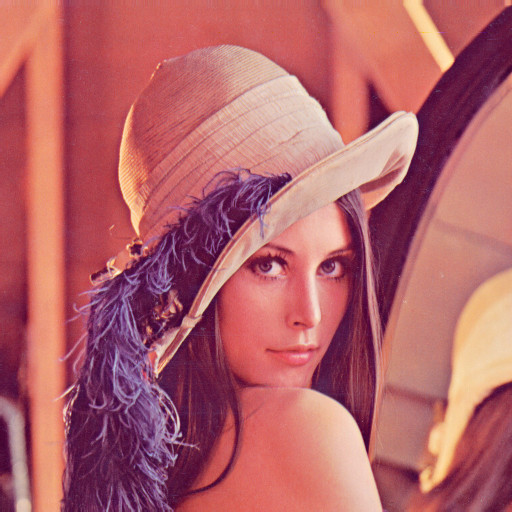

Das ist das Beispielmöbel.
__________________________

Hier erklärt es das text format
###############################

es handelt sich dabei um RestructuredText_

RestructuredText_ ist ein Format das versucht sowohl im browser als auch im Texeditor lesbar zu bleiben.

.. _RestructuredText: http://docutils.sourceforge.net/docs/user/rst/quickref.html

Änderungen zu normalem RST:

Die letzte überschrift, der obersten Ebene, wird auch zum Titel der Seite. Heisst in der praxis: man sollte h1 nur 1 mal am anfang verwenden.

Das erste Bild wird in der Möbel übersicht verwendet.
Es sollte Querformat sein.

Es gibt einen besonderen Textblock:

Info:
Preis: 6.30€ Verkauft
Design: Raoul Facchin
Ausführung: Raoul Facchin
Material: Kartoffeln und Sauce

Bedingung für das funktionieren dieses Blocks sind die Wörter vor dem Doppelpunkt:

Die preis zeile hat die eigrnschaft das der preis durchgestrichen dargestellt wird wenn das Wort Verkauft in der Zeile vorkommt 

Ein weiteres bild um auch die indirekte Referenz herzuzeigen |lenna|

Zu beachten ist die fussnote am Ende des Texts

**Wichtig auch:** damit eine neue Seite ein neues möbel auch angezeigt werden muss sie in die config.py datei eingetragen werden. die findet sich im verzeichniss über möbel. 

Sie bestimmt einige parameter der seite. Unteranderem auch die reihenfolge der Möbel/Seiten in den menues.

Wenn as alles erledigt ist kann man mit python3 renderer/main.py -i projektordner die homepage rendern.

