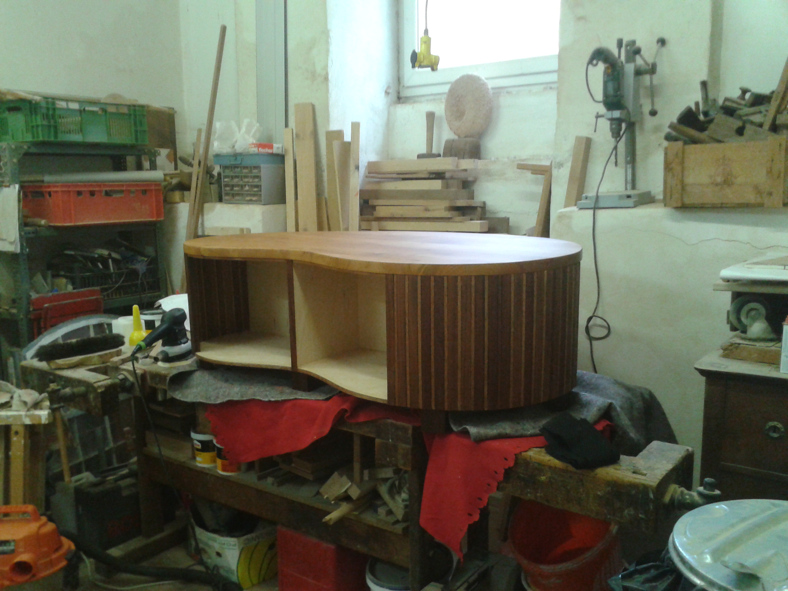
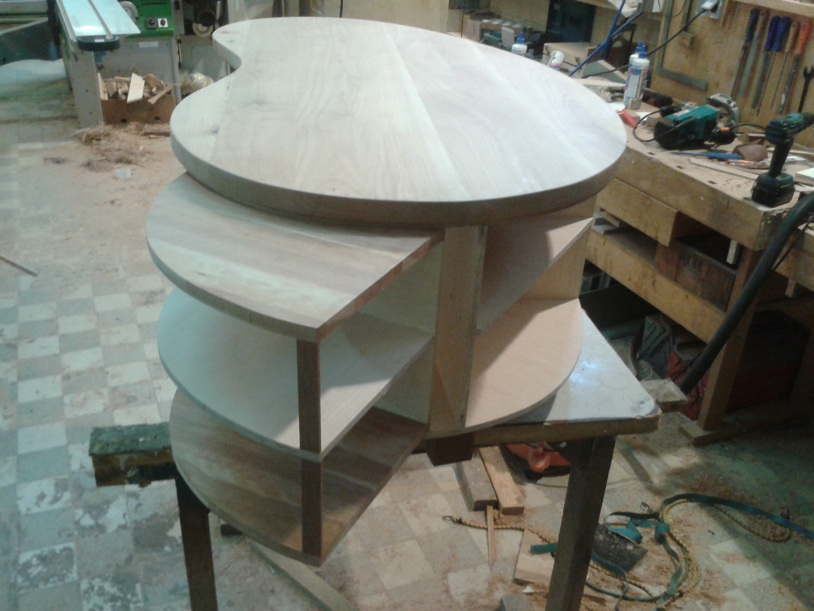

Titel. z.B. Tisch Eiche
-----------------------

Man kann viele symbole verwenden um eine überschrift zu kennzeichnen
allerdings sollte man h1 nur einmal verwenden
in unserem konkreten fall nichts mehr mit --- unterstreichen.

h2
~~~~~~~

h3
======

Ein absatz ist von eine Leerzeilen gefolgt.

Ein bild sieht so aus: 
|S|
Man beachte die Fusnote 

Einzelne Newlines
aendern nichts am HTML
koennen aber im texteditieren leserlicher sein

|U|

Text Verzierungen:
*kursiv* schreibt man so "``*kursiv*``", **fett** so
"``**fett**``".

