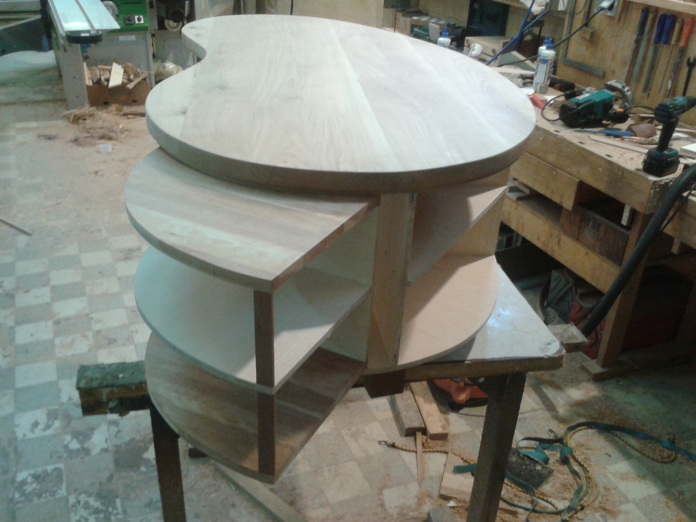

Titel. z.B. Tisch Eiche
-----------------------

h2
~~~~~~~

h3
======

h1
------

Ein absatz ist von zwei Leerzeilen gefolgt.
|S|

Noch ein Absatz
Absätze können auch so gegliedert werden
mit newlines

|U|

.. |S| image:: titel.jpg
